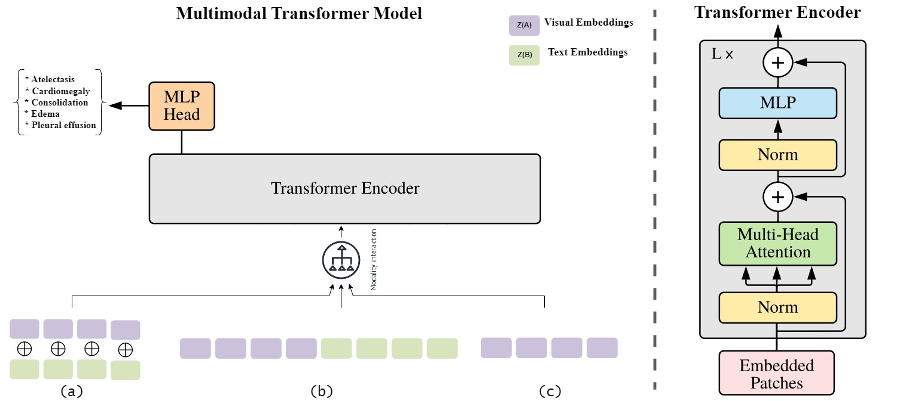
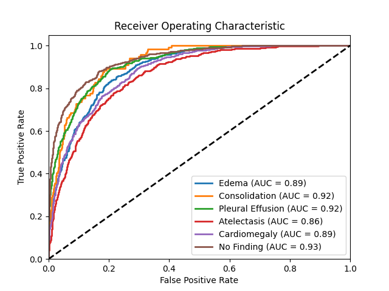

# Multimodal Transformer for Enhanced Pathology Detection in Chest X-Ray Images

## Overview
This repository contains the code and documentation for a research project focused on applying a Multimodal Transformer model to improve pathology detection in chest X-ray images. The project integrates image and clinical text data to enhance diagnostic accuracy.

## Project Description
The project aims to address the challenges in interpreting chest X-ray images by using multimodal data. It involves creating a multimodal dataset from the MIMIC-CXR and MIMIC-CXR-JPG datasets, processing clinical text with Clinical BERT, and processing chest radiographic images with Densenet121. The Multimodal Transformer model was developed using PyTorch, a leading deep learning framework that provides flexibility and a rich set of tools for building complex neural network architectures.

## Ethical Considerations and Data Usage
To access and use the MIMIC datasets (MIMIC-CXR and MIMIC-CXR-JPG), researchers must comply with the requirements for Research Involving Human Subjects. The authors of this project used these datasets, accessed through authenticated means, to create the multimodal dataset. No additional data involving human participants were collected for this research.

## Features
- **Dataset Integration**: Combining MIMIC-CXR and MIMIC-CXR-JPG datasets.
- **Text Processing**: Utilizing Clinical BERT for clinical text analysis.
- **Image Processing**: Using Densenet121 for image data analysis.
- **Transformer Model**: Implementing a multimodal transformer with various fusion strategies.
- **Performance Evaluation**: The model is evaluated using AUC-ROC metrics, focusing on several pathologies.

## Installation
Instructions for cloning the repository and setting up the environment.
pip install pandas 
pip install numpy 
pip install torch 
pip install torchvision 
pip install torchxrayvision 
pip install transformers 
pip install opencv-python
pip install sklearn 
pip install matplotlib 
pip install tqdm 
pip install dask
## Usage
### Adjusting File Paths
* Open the script files in the repository.
* Locate the lines where the MIMIC dataset paths are defined.
* Update these paths to point to the locations where you extracted the MIMIC datasets on your system.
### Running the Scripts
* embedding_based_medical_processor.py - This script processes the medical data.
* mimic_dataset_embbeding.py - This script handles dataset embedding.
* multimodal_data_processor.py - Use this script for processing multimodal data inputs.
* multimodal_transformer_model.py - Finally, run this script to implement the transformer model for pathology detection.

###Model Checkpoint
The best checkpoint of the Multimodal Transformer model, which has been trained and evaluated on the MIMIC datasets, is available for download. You can use this checkpoint to quickly start using the model without the need for training from scratch.

###Using the Checkpoint
After downloading the checkpoint file, place it in the appropriate directory within your project. Update the model loading section in the code to use this checkpoint file for initializing the model in multimodal_transformer_model.py

## Dataset Information

### MIMIC-CXR and MIMIC-CXR-JPG Datasets
This project utilizes the MIMIC-CXR and MIMIC-CXR-JPG datasets. These datasets are large-scale, publicly available datasets containing de-identified chest radiographs along with associated radiology reports.

#### MIMIC-CXR Dataset
- **Description**: Contains de-identified radiological reports associated with chest X-rays.
- **Access**: Available through PhysioNet (https://physionet.org/content/mimic-cxr/2.0.0/). Access requires completion of a data use agreement and adherence to specific ethical guidelines.

#### MIMIC-CXR-JPG Dataset
- **Description**: Comprises a vast collection of chest radiograph images in JPG format, corresponding to the reports in the MIMIC-CXR dataset.
- **Access**: Available through PhysioNet (https://physionet.org/content/mimic-cxr-jpg/2.0.0/). Similar to MIMIC-CXR, access requires completion of a data use agreement and adherence to ethical standards.

### Ethical Considerations and Compliance
- **Research Involving Human Subjects**: This project involves the use of human subject data from the MIMIC-CXR and MIMIC-CXR-JPG datasets. The authors accessed these datasets through authenticated means, strictly for research purposes.
- **Data Usage**: No additional data involving human participants were collected for this research. All data usage complied with the terms of the data use agreement and ethical guidelines set forth by the data providers.
- **Data Privacy**: The datasets are de-identified to protect patient privacy. Researchers must maintain this confidentiality and use the data responsibly.

### Data Integration and Processing
- The project involves integrating data from both the MIMIC-CXR and MIMIC-CXR-JPG datasets to create a comprehensive multimodal dataset.
- Clinical text data from radiology reports is processed using Clinical BERT, while chest radiographic images are processed using Densenet121.

### Access Requirements
- Researchers wishing to access these datasets must apply for access through PhysioNet and complete the required training in human research protections.
- It is mandatory to adhere to the data use agreement, which includes stipulations on data privacy, ethical usage, and publication requirements.

## Results
The project's findings, including the model's performance metrics and effectiveness in pathology detection.

